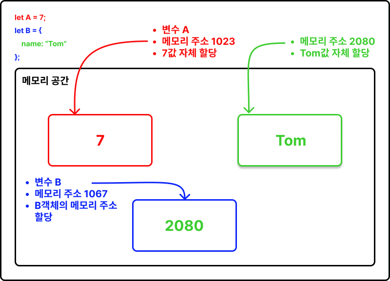

### 얕은 복사(Shallow copy), 깊은 복사(Depp copy)

- 얕은 복사는 객체의 참조값(주소값)을 복사한다.

- 깊은 복사는 값 자체를 복사한다.

<br>

### 얕은 복사(Shallow copy)

- 값의 메모리 주소를 복사

- 참조 타입에만 적용된다 <br>
  객체 { }, 배열 [ ], 함수 function( ) { }

```
const obj1 = { a:1, b:1 };
const obj2 = obj1;

obj2.a = 100;

console.log(obj1.a); // 100
console.log(obj2.a); // 100

```

obj2에 obj1에 저장된 객체의 메모리 주소를 할당 하였다. <br>
obj1과 obj2는 같은 메모리 주소를 가리키고 있다. <br>
obj1로 속성에 접근하여 값을 변경하면 obj2의 속성값도 똑같이 변경된다.

<br>

### 깊은 복사(Depp copy)

- 값 자체를 복사

- 원시 타입에만 적용된다 <br>
  number, string, boolean, undefined, null, symbol

```
// 원시 타입의 깊은 복사
let a = '원본 Data';
let b = a;

a = '수정 Data';

console.log(a); // 수정 Data
console.log(b); // 원본 Data
```

a와 b는 서로 다른 메모리 주소를 가진 저장 공간이다 <br>
a에 저장된 값을 b에 할당했다 <br>
a에 다른 값을 넣어도 b에는 아무런 영향을 주지 않는다. <br>

<br>

### 객체나 배열의 깊은 복사(Shallow copy)

- 얕은 복사 복사로 인한 현상을 방지하기 위해 값의 메모리 주소가 아닌 참조 타입의 값 자체를 복사한다.

- 참조 타입의 값 자체를 복사.

- 스프레드 연산자(전개 연산자)나 Object.assign({}, 원본객체)를 활용한다. <br>

  - 배열이나 객체의 값들만 펼쳐 반환하는 연산자(함수의 인자, 배열, 객체 안에서 사용할 수 있다).

- 중괄호나 대괄호는 새로운 참조 타입 값의 메모리 주소를 생성한다. 여기에 스프레드 연산자(전개 연산자)를 사용해서 내용들을 가져오면 새로운 참조값에 같은 내용을 가진 값을 만들 수 있다.

```
const obj1 = {a:1, b:1};
const obj2 = {...obj1};

obj2.a = 100;

console.log(obj1.a) // 1
console.log(obj2.a) // 100

```

<br>

### 얕은 복사와 깊은 복사 설명 이미지


