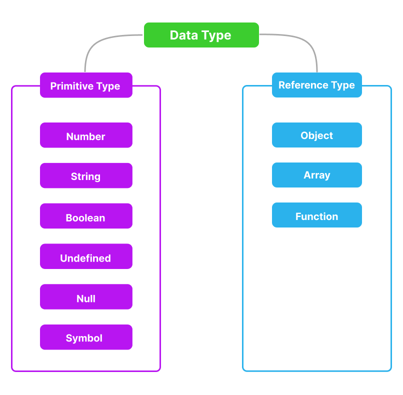

## 원시 타입(primitive type)과 참조 타입(reference type)

### 원시 타입 (Primitive Type)

| 타입             | 예시                             | 설명                       |
| ---------------- | -------------------------------- | -------------------------- |
| 숫자 (Number)    | 42, 3.14, -7                     | 정수와 부동소수점 숫자.    |
| 문자열 (String)  | "Hello", 'World', \`안녕하세요\` | 텍스트 데이터.             |
| 불리언 (Boolean) | true, false                      | 논리값, 참 or 거짓.        |
| undefined        | undefined                        | 값을 할당하지 않은 상태.   |
| null             | null                             | 빈 빈 값을 할당한 상태.    |
| 심볼 (Symbol)    | Symbol('description')            | 고유하고 변경 불가능한 값. |

 

- 원시 타입이 변수에 할당 될 때는 변수 메모리에 원시 타입의 값(value) 자체가 저장된다.

- undefined - 값을 할당하지 않은 상태(정의 하지 않을 경우 자동으로 할당).

- null - 빈 값을 할당한 상태(사용자가 직접 할당).

   

### 참조 타입(Reference type)

| 타입            | 예시               | 설명                          |
| --------------- | ------------------ | ----------------------------- |
| 객체 (Object)   | { key: "value" }   | 속성(key)과 값(value)의 집합. |
| 배열 (Array)    | [1, "two", 3.14]   | 순서가 있는 값들의 집합.      |
| 함수 (Function) | function() { ... } | 재사용 가능한 코드 블록.      |

 

- 참조 타입이 변수에 할당 될 때는 변수 메모리에 참조 타입의 값 즉 참조 타입의 메모리 주소가 저장된다.

- 참조 : 데이터가 저장된 메모리의 위치.
