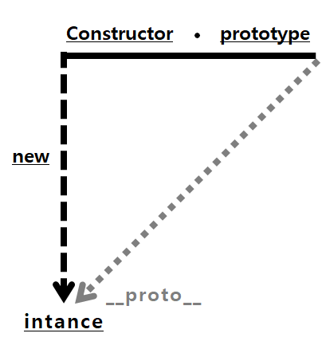

## prototype

- 객체들 끼리 공유할 수 있는 속성과 메소드를 정의한 원본 객체.

- prototype : 원형 

<br>

### prototype의 특징
- 여러 객체가 비슷한 기능을 가질 때 중복되는 기능을 각 객체마다 정의하지 않고 프로토타입에 정의하여 이를 참조하여 사용할 수 있게 한다 <br>
(이를 통해 메모리를 효율적으로 사용하고 코드를 간결하게 만들어 준다).

- 프로토타입 기반 언어는 어떤 객체를 원형으로 삼고 이를 복제 하여 사용한다(클래스 기반 언어에서 사용하는 상속과 유사하다)

- 자바스크립트는 프로토타입 기반 객체지향 프로그래밍 언어이다. <br>
  (참고로 Java, C++는 클래스 기반 객체지향 프로그래밍 언어이다).

<br>

### prototype 설명
 <br>
이미지 출처 - https://codify.tistory.com/41

- new 연산자로 생성자 함수를 호출하면

- Constructor에서 정의된 내용을 바탕으로 instance가 생성된다.

- 이 instance에는 __proto__라는 프라퍼티가 자동으로 부여되고 <br>
  (브라우저 콘솔 창에서는 [[Prototype]]으로 표시된다)

- 이 프라퍼티는 Constructor의 prototype이라는 프라퍼티를 참조한다.

- prototype 객체 내부에는 인스턴스에 사용될 내용들이 정의된다.

```javascript
function Person(name, age) {
    this.name = name;
    this.age = age;
}

const person1 = new Person();

console.log(Person.prototype);
console.log(person1.__proto__);

```
- Person.prototype과 person1.__proto__는 같은 내용을 출력한다.

<br>

### 알아볼 키워드
- 래퍼 객체

- 프로토타입 체인 - 포로토 속성을 이용해서 프로토타입 속성에 타고 타고 접근하는것

- 프로토타입 사용 이유는 참조 떄문.


<br>

### 참고 자료

- 코어 자바스크립트 정재남

- https://poiemaweb.com/js-prototype

