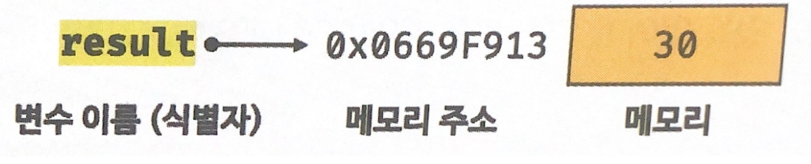

## Variable

### 변수의 정의

- 값을 저장하기 위해 확보한 메모리 공간 또는 그 **메모리 공간을 식별하기 위해 붙인 이름**.

<br>

### 식별자

- 식별자는 값이 아니라 값을 저장하기 위한 메모리 공간의 주소를 가지고 있다.

- 이 메모리 주소를 통해 메모리 공간에 저장된 값에 접근 할 수 있다.

- 식별자는 값이 저장되어 있는 메모리 주소와 매핑관계를 맺으며 해당 메모리에 저장되어 있다

  ```javascript
  var result = 10 + 20;
  console.log(result);
  ```

  

<br>

### 변수 선언

- 값을 저장하기 위한 메모리 공간을 확보하고 변수 이름과 확보된 메모리 공간의 주소를 연결하는 것(값을 저장할 수 있게 준비하는 것).

- var, let const 키워드를 통해 저장 공간을 확보하고, 이름과 메모리 공간의 주소를 연결 할 수 있다.

  ```javascript
  // score라는 이름을 가진 저장공간을 선언(이 저장 공간에는 식별자와 메모리 주소가 매핑 관계를 맺으며 저장되어 있다.).
  var score;
  ```

<br>

### 호이스팅

- 주어진 코드에서 선언된 변수들만 읽어들여 메모리에 등록하는 것(저장)하는 것.

- 자바스크립트는 평가 단계와 실행 단계 이 두 가지 단계를 거쳐 코드를 실행시킨다 <br>.

- 평가 단계 : 소스 코드에 선언된 식별자만 읽어들인다(선언된 변수들만 읽어들여 메모리에 등록하는 것, 실행을 위한 준비 단계).
  실행 단계 : 등록된 식별자를 기초로 선언문을 제외한 소스 코드를 한 줄씩 읽어들여 실행(런타임).

```javascript
var score;
console.log(score); // undefined
score = 100;
console.log(score); // 100
```

<br>

### 값의 할당

- 변수에 값을 저장하는 것.

- 할당 연산자 = 을 통해 값에 변수를 할당 할 수 있다.

  ```javascript
  // 변수 선언과 값의 할당을 따로 하는 방식
  var score; // 변수 선언
  score = 80; // 값의 할당

  // 변수 선언과 갓의 할당을 동시에 하는 방식
  var scroe = 80;
  ```

- 변수 선언과 값의 할당을 따로하는 방식과 동시에 하는 방식은 내부적으로 변수 선언과 값의 할당을 따로 하는 방식으로 똑같이 동작한다(호이스팅).

<br>

### 값의 재할당

- 값을 변수에 재할당 한다는 것은 변수에 있던 기존값을 지우고 새로운 값을 할당하는 것이 아니다.

- 새롭게 할당 할 데이터(값)를 새롭게 만들고 해당 값의 주소 값을 식별자에 저장하는 것.

<br>

### 변수에서 사용되는 용어

- 변수 이름 <br>
  변수의 정의 참고. <br>
  식별자라고도 한다.

- 변수 값 <br>
  변수에 저장된 값

- 초기화 <br>
  변수가 선언된 이후 최초로 값을 할당하는 것.

- 매핑 <br>
  매핑 = 키 + 값

- 런타임 <br>
  소스코드가 순차적으로 실행되는 것.

- 가비지 컬렉터(garbage collector) <br>
  메모리 공간을 주기적으로 검사하여 더 이상 사용되지 않는 메모리를 해제하는 기능. <br>
  더 이상 사용하지 않는 메모리란 **데이터 영역에 있는 값들중 식별자에 할당되어져 있지 않는 데이터들을 의미한다**.

<br>

### 추가 정리

- 식별자와 값, 메모리 주소 관련 이미지 추가.
- 값의 할당 내용 구체적으로(다른 값으로 할당할 떄 기존에 데이터 영역에서 데이터 유무를 검색하고 없을 경우 새롭게 데이터를 만들고 할당한다는 내용 등).

<br>

### 참고자료

- 이웅모. (2020). 모던 자바스크립트 Deep Dive. 위키북스
